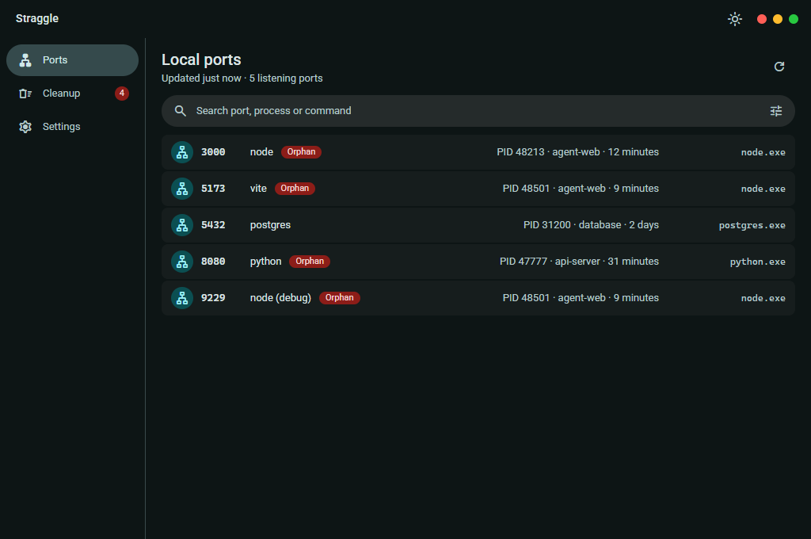
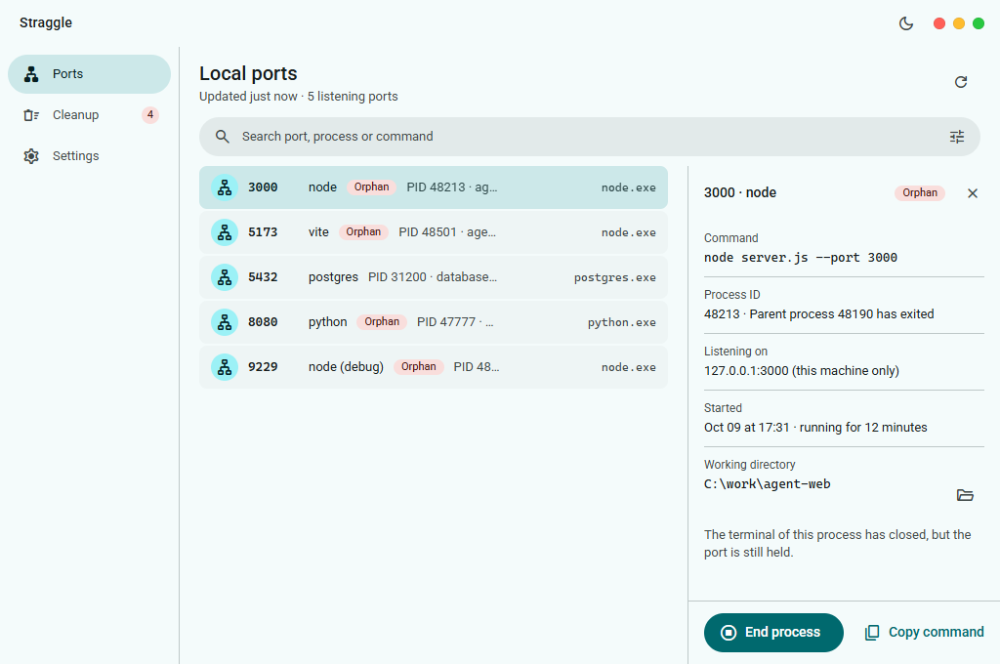
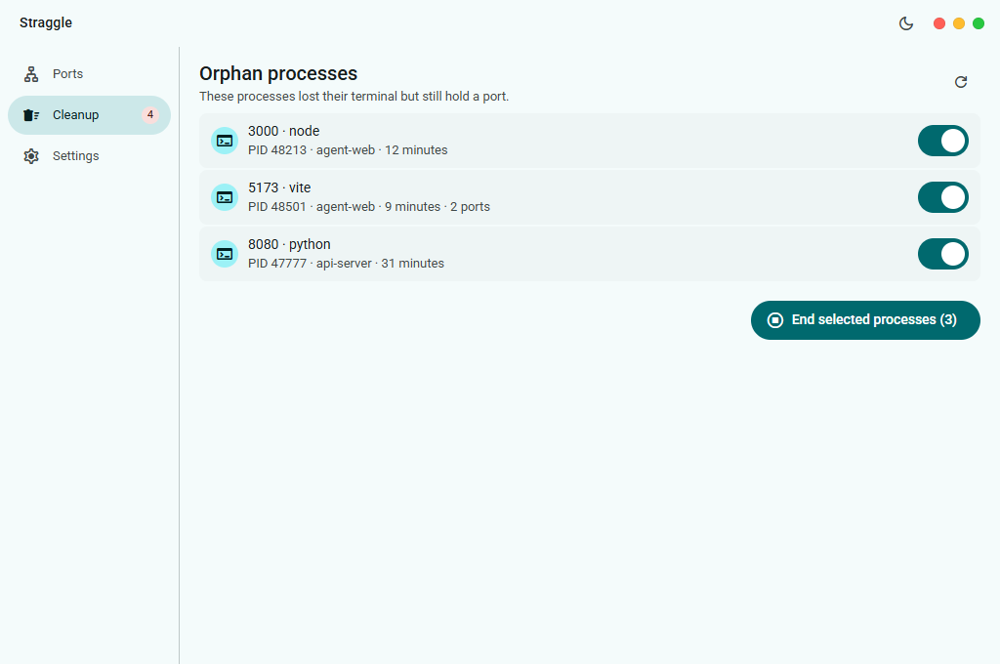
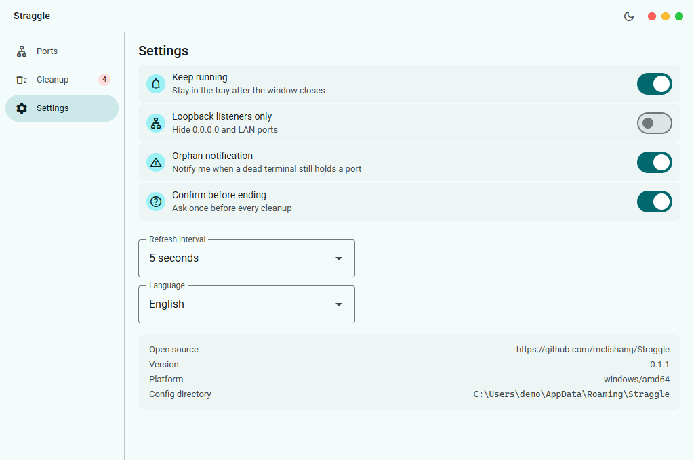
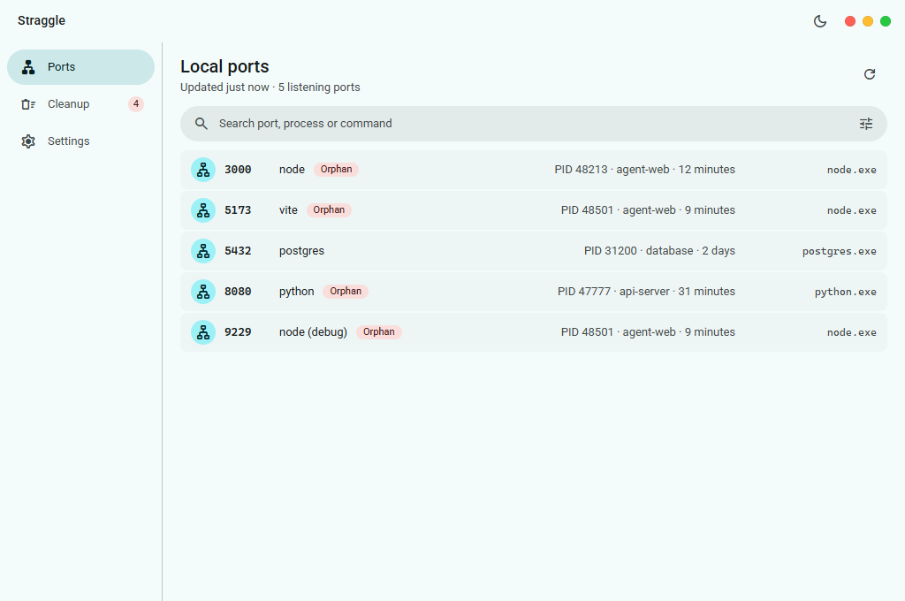
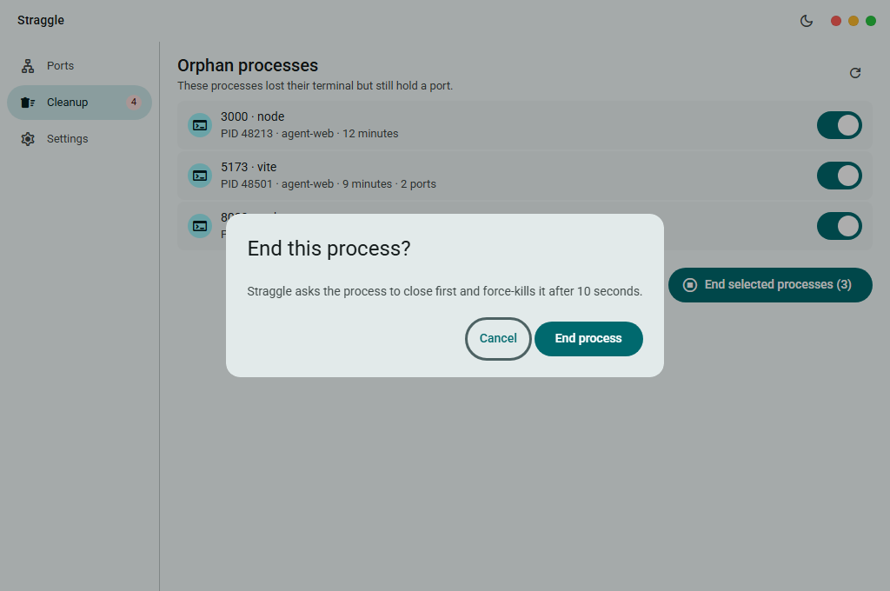

# Straggle

[简体中文](README.zh-CN.md)

A desktop manager for local listening ports and orphan processes — shipped as a single-file Windows app.

Straggle lines up every listening port on the machine with the process that actually holds it: PID, full command line, working directory (which project it belongs to), how long it has been running, and **the real executable that is running on the system**. When you need a port back, it can clear out the orphan processes whose terminal is long gone but whose port is still held — ending them gracefully first, and force-killing after 10 seconds.

> Stack: Go · [Wails v2](https://wails.io) · WebView2 · Material Web (lit) · Vite — the frontend build is embedded into the exe with `go:embed`.
> Platform: Windows 10/11 x64. The window opens at 1024×680, minimum 880×520, freely resizable.



## Features

| Module | Capability |
| --- | --- |
| **Port list** | Every listening port; each row is `port · display name · badge · PID · project · uptime · program`; search (port / process / command / executable name), sorting, and a switch for including UDP; one-click refresh and automatic polling; selecting a row expands its details on the right |
| **Port details** | Full command line, process ID and parent process, listening addresses and reachable scope, start time, working directory (openable in place), copy the command, end the process |
| **Orphan cleanup** | Lists the "terminal is closed but the port is still held" entries per process, ends them in batch after you tick them, and summarises the outcome row by row |
| **Safety valve** | Verifies with the process **creation time** whether a PID has been reused before acting; refuses anything matching the critical system process list or living under `%SystemRoot%`, and states the reason in the UI |
| **Settings** | Background resident, only loopback listening, orphan notification, confirm before killing, refresh interval — all persisted |
| **Theme** | One click in the top bar switches light / dark; left alone, it follows the system |
| **Language** | English and Simplified Chinese; one click in Settings switches the window, the tray menu and the notifications together, and left alone it follows the Windows UI language |

## Screenshots

| Port details | Orphan cleanup |
| --- | --- |
|  |  |

| Settings | Light theme |
| --- | --- |
|  |  |

| Kill confirmation |
| --- |
|  |

## Interface

There is one desktop layout only: no mobile form and no responsive breakpoints — as the width changes, the list and the content area stretch proportionally.

```
┌──────────────────────────────────────────────────────────┐
│ Straggle                              ☀   ● ● ●          │  top bar 48dp (drag area + theme button + traffic lights)
├────────────┬─────────────────────────────────────────────┤
│ Ports      │ Local ports                     ⟳           │  screen header
│ Cleanup (n)│ Updated just now · 37 listening ports        │
│ Settings   ├─────────────────────────────────────────────┤
│            │ Search…                              ⚙︎      │  toolbar
│  sidebar   ├────────────────────────┬────────────────────┤
│  184dp     │ port list (scrolls)    │ details 320dp       │  expands on selection
└────────────┴────────────────────────┴────────────────────┘
```

- **No scrollbars**: scroll containers hide the native scrollbar (wheel / keyboard / trackpad still scroll), so the list and the toolbar stay aligned once the 6–15px the bar would have taken is gone.
- **Alignment**: the top-bar brand, the sidebar icons, the screen header title, the toolbar and the list rows all start from a single `--app-edge` (20px) gutter.
- **Each row ends with the program that is really running**: the display name may be a tool name inferred from the command line (`vite`, `node debug`), while the last column is always the real executable on the system (`node.exe`, `lsass.exe`, `System`) — hover reveals the full path, and when process information cannot be read it says "unknown" honestly instead of guessing a name. The uptime column and the program column each right-align to their own vertical line, and the badge sits next to the name.
- **Desktop density**: list rows 44dp, controls 40dp, corner radii 8/12/16/full, and a type scale one step smaller than a mobile layout.
- **Large lists**: a single snapshot renders at most 300 rows and says so above the list when truncated.

## Build

Prerequisites: [Go](https://go.dev/dl/) 1.26+, [Node](https://nodejs.org/) 20+, the WebView2 runtime (normally preinstalled on Windows 10/11).

```powershell
# 1. Frontend dependencies and production build (the icon is included)
cd frontend
npm install
npm run build          # outputs frontend/dist

# 2. Desktop artifact
cd ..
go mod tidy
go install github.com/wailsapp/wails/v2/cmd/wails@latest   # first time only
wails build                                                # outputs build/bin/Straggle.exe
```

Without the Wails CLI you can build with plain Go (run `npm run build` in the frontend first):

```powershell
go build -tags desktop,production -ldflags "-w -s" -o build/bin/Straggle.exe .
```

## Usage

### Window

The window is **frameless** (Wails `Frameless: true`), and the system title bar is replaced by **macOS-style traffic lights** drawn in the top-right corner: red = close, yellow = minimise, green = maximise / restore.

- Normally only the three dots are shown; **hovering the group** reveals the glyphs (✕ / − / two triangles), and the whole group greys out when the window loses focus. Focusing one of them by keyboard shows its glyph too.
- The three buttons are pinned to the top-right of the **window** (not of the content area), so they stay against the window edge when it is widened or maximised.
- **Moving the window**: drag the top bar; double-click the top bar to maximise / restore; drag within 6px of any window edge to resize.
- The close button shares one policy with the system close paths (Alt+F4, taskbar context menu): with **background resident** on, the window hides to the tray; only with it off does closing really quit.

### Theme

Colour tokens are written once as `light-dark(light, dark)` (`frontend/src/theme/tokens.css` is the only place in the project where colour literals may appear). Which half applies is decided by the `color-scheme` under `<html data-theme>`, so switching themes needs no second set of colour values and causes no flash.

- The top bar has a **theme button** to the left of the window buttons: one click toggles between light and dark, the icon shows what you would switch *to*, and the tooltip and the accessibility label stay in sync (`Switch to dark` / `Switch to light`).
- The choice is written to the `theme` field of `settings.json` (`"light"` / `"dark"`) and survives a restart; when the field is absent the app **follows the system**, and the interface then follows every system light/dark change (`internal/theme` polls the registry).
- Once you have pressed the button it is your choice that counts: later system theme changes no longer override an explicit selection.

### Language

Two text catalogues ship with the app: `frontend/src/strings.js` holds everything the interface renders, and `internal/i18n` holds what Go renders itself — errors, the tray menu, notifications and humanized durations and timestamps. The `language` field of `settings.json` is `""` to follow the Windows user UI language, or `en` / `zh-CN` to pin one.

- The Settings screen has a **Language** field. Picking a value applies immediately, because saving triggers a rescan that rebuilds the Go-side row text and pushes it back in the next snapshot.
- The tray menu is relabelled from the same catalogue and the notifications are written in the same language, so nothing is left in the previous one.
- `Snapshot.language` carries the resolved language to the frontend, which switches its own catalogue to match.

### Configuration

Settings are stored in `%APPDATA%\Straggle\settings.json` (written atomically; a corrupt file falls back to the defaults and is rewritten).

| Setting | Default | Notes |
| --- | --- | --- |
| Background resident | On | Keeps running in the tray after the window is closed |
| Only loopback listening | Off | Hides `0.0.0.0` and LAN ports |
| Orphan notification | On | Notifies you when a terminal is gone but its port is still held |
| Confirm before killing | On | Every cleanup asks for confirmation first |
| Refresh interval | 5 s | 1 / 5 / 10 s; a shorter interval is more current and uses more power |
| Theme | Follow system | `light` / `dark` once you pick one |
| Language | Follow system | `en` / `zh-CN` once you pick one; applies immediately |

## Architecture

```
main.go / app.go          Wails wiring: window, bound methods, event push, tray, theme (follow system + manual switch)
internal/model            domain model (the JSON contract with the frontend)
internal/scan             port scan + process metadata + orphan detection
internal/kill             ending processes: request handling / 10s watchdog / platform implementation
internal/settings         atomic read/write of %APPDATA%\Straggle\settings.json
internal/theme            Windows light/dark from the registry
internal/tray             tray icon and menu (background resident)
internal/i18n             the Go-side text catalogue: both languages per key, plus the selected language
internal/humanize         language-aware duration / timestamp text
internal/tests            Go tests, one file per subject (humanize / kill / scan / settings)
frontend/tests/           frontend tests on node:test (npm test)
frontend/                 Vite + lit + @material/web; the build output is embedded into the exe with go:embed
frontend/preview/         fake backend for the browser preview (loaded dynamically only with ?mock=1)
```

Data flows one way: the Go side scans on a timer → builds a snapshot → pushes it with the `snapshot:update` event → the frontend only renders; the frontend calls refresh / kill / save-settings through the bound methods (`window.go.main.App.*`).

## Development

```powershell
wails dev                            # desktop development mode (frontend hot reload)
cd frontend && npm run dev           # frontend only; open http://localhost:5173/?mock=1 in a browser
```

The browser preview renders the interface from fake data in `frontend/preview/`, and supports deep-link parameters:

```
?mock=1&theme=dark&screen=cleanup&key=<entry key>&lang=en|zh-CN&dialog=kill
```

The fake data is loaded dynamically only when `?mock=1` is present; the running app never touches it.

Checks and tests:

```powershell
gofmt -l .                 # expected to print nothing
go vet ./...
go test ./...              # humanize / kill / scan / settings
cd frontend && npm test    # frontend test on node:test
```

The Go tests live in one module: `internal/tests/` (package `tests`), one file per subject — `humanize_test.go`, `kill_test.go`, `scan_test.go` and `settings_test.go`; no `_test.go` file exists anywhere else, and they use exported APIs only. The frontend test lives in `frontend/tests/` and runs on `node:test`.

## License

Straggle is free software, released under the [GNU General Public License v3.0](LICENSE).
