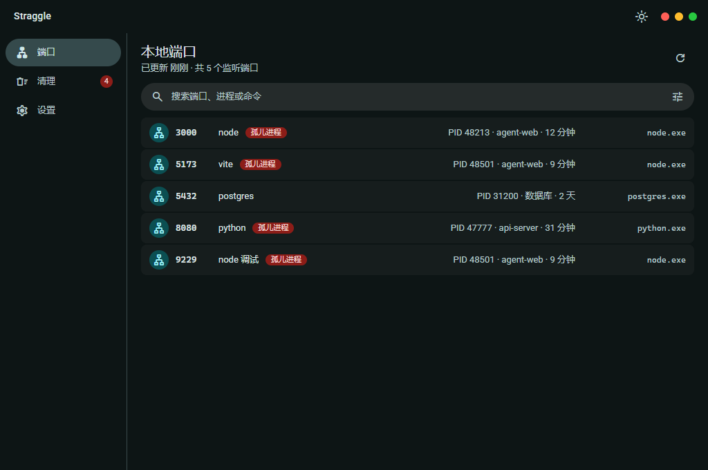
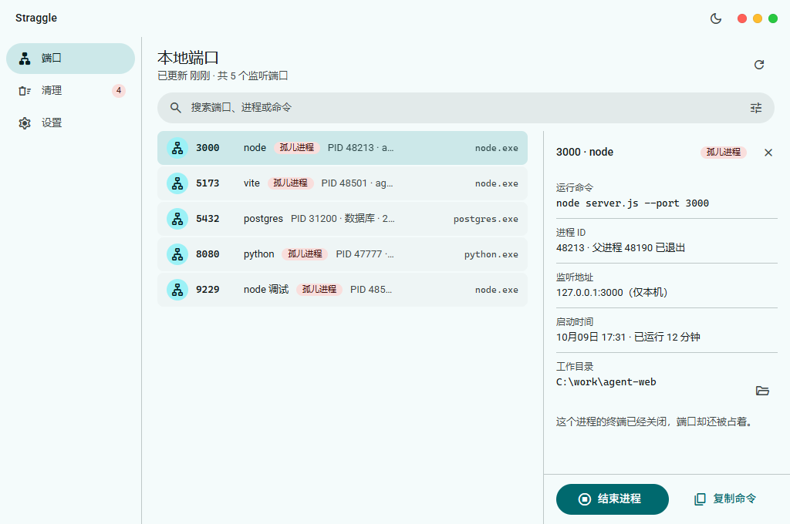
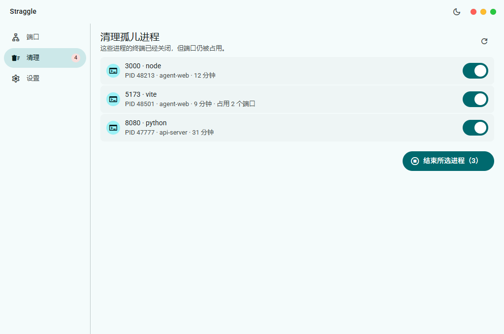
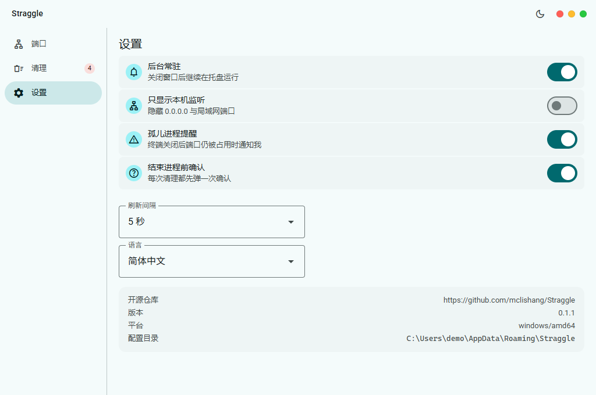
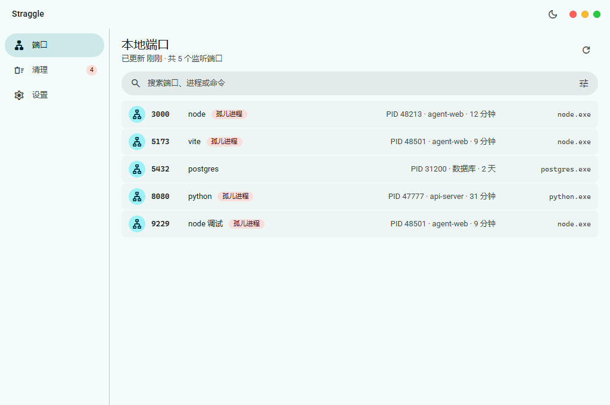
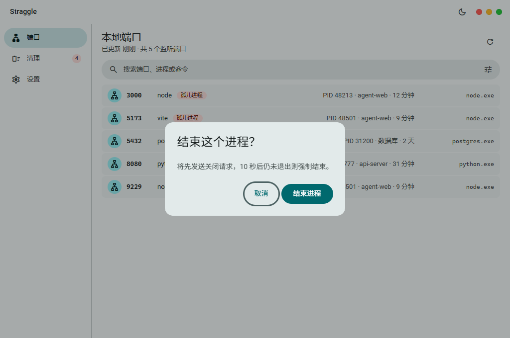

# Straggle

[English](README.md)

本地监听端口与孤儿进程的桌面管理器 —— 一个单文件 Windows 应用。

Straggle 把系统里所有正在监听的端口，和真正占着这些端口的进程对齐：PID、完整命令行、工作目录（属于哪个项目）、
已经跑了多久，以及**系统里真正在跑的可执行文件**。想腾出某个端口时，它能把「终端早就关了、端口却还占着」的
孤儿进程一次清理干净 —— 先优雅结束，10 秒不退出再强制。

> 技术栈：Go · [Wails v2](https://wails.io) · WebView2 · Material Web（lit）· Vite —— 前端产物 `go:embed` 进 exe。
> 平台：Windows 10/11 x64。窗口 1024×680 起步，最小 880×520，可自由缩放。



## 特性

| 模块 | 能力 |
| --- | --- |
| **端口列表** | 全部监听端口；每行是 `端口 · 展示名 · 徽标 · PID · 项目 · 运行时长 · 程序`；搜索（端口 / 进程 / 命令 / 程序名）、排序、可切换是否包含 UDP；一键刷新与自动轮询；选中某行右侧展开详情 |
| **端口详情** | 完整运行命令、进程 ID 与父进程、监听地址与可达范围、启动时间、工作目录（可直接打开）、复制命令、结束进程 |
| **清理孤儿进程** | 按进程列出「终端已关闭但端口仍被占用」的条目，勾选后批量结束，逐条汇总结果 |
| **安全阀** | 动手前用**创建时间**校验 PID 是否已被复用；命中关键系统进程或位于 `%SystemRoot%` 下的进程一律拒绝，并在界面上说明原因 |
| **设置** | 后台常驻、只显示回环监听、孤儿进程提醒、结束进程前确认、刷新间隔，全部持久化 |
| **主题** | 顶部栏一键切换浅色 / 深色；不按它时跟随系统 |
| **语言** | 英文与简体中文两套文案；在设置里一键切换，窗口、托盘菜单与通知同时生效，不选时跟随 Windows 界面语言 |

## 截图

| 端口详情 | 清理孤儿进程 |
| --- | --- |
|  |  |

| 设置 | 浅色主题 |
| --- | --- |
|  |  |

| 结束确认 |
| --- |
|  |

## 界面

只有一套桌面布局：没有移动端形态，也没有响应式断点，宽度变化时列表与内容区按比例伸缩。

```
┌──────────────────────────────────────────────────────────┐
│ Straggle                              ☀   ● ● ●          │  顶部栏 48dp（拖动区 + 主题按钮 + 交通灯）
├────────────┬─────────────────────────────────────────────┤
│ 端口       │ 本地端口                        ⟳            │  屏头
│ 清理   (n) │ 已更新 刚刚 · 共 37 个监听端口               │
│ 设置       ├─────────────────────────────────────────────┤
│            │ 搜索…                                ⚙︎       │  工具条
│  侧边栏    ├────────────────────────┬────────────────────┤
│  184dp     │ 端口列表（滚动）        │ 详情面板 320dp      │  选中后展开
└────────────┴────────────────────────┴────────────────────┘
```

- **没有滚动条**：滚动容器隐藏原生滚动条（滚轮 / 键盘 / 触控板照常滚动），避免滚动条吃掉 6~15px
  宽度后，列表与工具条左右不再对齐。
- **对齐**：顶部栏品牌、侧边栏图标、屏头标题、工具条与列表行统一从 `--app-edge`（20px）起排。
- **每行末尾是「真实在跑的程序」**：展示名可能是从命令行推断出来的工具名（`vite`、`node 调试`），
  行尾那列始终是系统里真正的可执行文件（`node.exe`、`lsass.exe`、`System`）—— 悬浮可见完整路径，
  读不到进程信息时如实显示「未知」，不猜名字。时长列与程序列各自右对齐成一条竖线，徽标挨着名字放。
- **桌面密度**：列表行 44dp、控件 40dp、圆角 8/12/16/full，字阶比移动端小一档。
- **大列表**：单次快照最多渲染 300 条，超出时列表上方给出提示。

## 构建

前置：[Go](https://go.dev/dl/) 1.26+、[Node](https://nodejs.org/) 20+、WebView2 运行时（Windows 10/11 一般已预装）。

```powershell
# 1. 前端依赖与生产构建（仓库已包含图标）
cd frontend
npm install
npm run build          # 输出 frontend/dist

# 2. 桌面产物
cd ..
go mod tidy
go install github.com/wailsapp/wails/v2/cmd/wails@latest   # 首次
wails build                                                # 输出 build/bin/Straggle.exe
```

没有 Wails CLI 时可以直接用 Go 构建（前端需先 `npm run build`）：

```powershell
go build -tags desktop,production -ldflags "-w -s" -o build/bin/Straggle.exe .
```

## 使用

### 窗口

窗口是**无边框**的（Wails `Frameless: true`），系统标题栏由右上角自绘的 **macOS 风格交通灯**替代：
红 = 关闭、黄 = 最小化、绿 = 最大化 / 还原。

- 平时只显示三枚圆点，**悬停整组**才浮现字形（✕ / − / 两枚三角），窗口失焦时整组变灰；
  键盘聚焦到某一枚时同样显示字形。
- 三枚按钮钉在**窗口**右上角（而不是内容区里），所以窗口拉宽或最大化后依然贴着窗口边缘。
- **拖动窗口**：按住顶部栏拖动；双击顶部栏 = 最大化 / 还原；窗口四边 6px 内可拖动改变大小。
- 关闭按钮与系统关闭方式（Alt+F4、任务栏右键）共用同一条策略：**后台常驻**开着时隐藏到托盘，
  关掉后才是真正退出。

### 主题

颜色令牌只写一次：`light-dark(浅色, 深色)`（`frontend/src/theme/tokens.css` 是全工程唯一允许出现
颜色字面量的地方）。用哪一半由 `<html data-theme>` 决定的 `color-scheme` 说了算，所以切换主题
不需要第二套色值，也不会闪色。

- 顶部栏右侧有一枚**主题按钮**（窗口按钮左边）：点一下在浅色 / 深色之间切换，图标显示的是
  「切过去会变成什么」，悬浮提示与无障碍标签同步（`切换到深色` / `切换到浅色`）。
- 选择写进 `settings.json` 的 `theme` 字段（`"light"` / `"dark"`），重启后保持；
  字段缺失表示**跟随系统**，此时系统深浅色一变界面就跟着变（`internal/theme` 轮询注册表）。
- 按过按钮之后就听用户的：系统的主题变化不再覆盖显式选择。

### 语言

应用内置两套文案表：`frontend/src/strings.js` 管界面渲染的每一个字，`internal/i18n` 管 Go 自己产出的文字 —— 报错、托盘菜单、通知，以及本地化的时长与时刻。`settings.json` 的 `language` 字段为 `""` 时跟随 Windows 用户界面语言，也可以钉死为 `en` 或 `zh-CN`。

- 设置页有**语言**一项。选中即生效：保存会触发一次重扫，Go 侧的行文本随之重建并推回下一帧快照。
- 托盘菜单用同一套文案表重新渲染，通知也用同一种语言写，不会留下上一门语言的残字。
- `Snapshot.language` 把解析后的语言带给前端，前端据此切换自己的文案表。

### 配置

设置保存在 `%APPDATA%\Straggle\settings.json`（原子写入；文件损坏时回落默认值并重写）。

| 项 | 默认值 | 说明 |
| --- | --- | --- |
| 后台常驻 | 开 | 关闭窗口后继续在托盘运行 |
| 只显示本机监听 | 关 | 隐藏 `0.0.0.0` 与局域网端口 |
| 孤儿进程提醒 | 开 | 终端关闭后端口仍被占用时通知我 |
| 结束进程前确认 | 开 | 每次清理都先弹一次确认 |
| 刷新间隔 | 5 秒 | 1 / 5 / 10 秒；间隔越短越及时，也越耗电 |
| 主题 | 跟随系统 | 按过按钮后为 `light` / `dark` |
| 语言 | 跟随系统 | 按过之后为 `en` / `zh-CN`，切换立即生效 |

## 架构

```
main.go / app.go          Wails 装配：窗口、绑定方法、事件推送、托盘、主题（跟随系统 + 手动切换）
internal/model            领域模型（前端 JSON 契约）
internal/scan             端口扫描 + 进程元数据 + 孤儿判定
internal/kill             结束进程：任务受理 / 10 秒看门狗 / 平台实现
internal/settings         %APPDATA%\Straggle\settings.json 原子读写
internal/theme            Windows 系统深浅色（注册表轮询）
internal/tray             托盘图标与菜单（后台常驻）
internal/i18n             Go 侧文案表：每键两种语言，以及当前所选语言
internal/humanize         本地化的时长 / 时刻文案
internal/tests            Go 测试，按主题一个文件（humanize / kill / scan / settings）
frontend/tests/           前端测试，跑在 node:test 上（npm test）
frontend/                 Vite + lit + @material/web；产物被 go:embed 进 exe
frontend/preview/         浏览器预览用的假后端（仅 ?mock=1 时动态加载）
```

数据流是单向的：Go 侧定时扫描 → 生成快照 → `snapshot:update` 事件推送 → 前端只渲染；
前端通过绑定方法（`window.go.main.App.*`）发起刷新 / 结束 / 保存设置。

## 开发

```powershell
wails dev                            # 桌面开发模式（前端热更新）
cd frontend && npm run dev           # 只跑前端，浏览器打开 http://localhost:5173/?mock=1
```

浏览器预览用 `frontend/preview/` 里的假数据渲染界面，支持深链参数：

```
?mock=1&theme=dark&screen=cleanup&key=<条目 key>&lang=en|zh-CN&dialog=kill
```

假数据只在带 `?mock=1` 时动态加载，应用运行时不会碰到它。

检查与测试：

```powershell
gofmt -l .                 # 期望无输出
go vet ./...
go test ./...              # humanize / kill / scan / settings
cd frontend && npm test    # 前端测试（node:test）
```

Go 测试全部放在一个模块里：`internal/tests/`（包名 `tests`），一个主题一个文件 —— `humanize_test.go`、`kill_test.go`、`scan_test.go`、`settings_test.go`；别处不存在 `_test.go` 文件，且只使用导出 API。前端测试放在 `frontend/tests/`，跑在 `node:test` 上。

## 许可证

Straggle 是自由软件，以 [GNU 通用公共许可证第 3 版](LICENSE) 发布。
